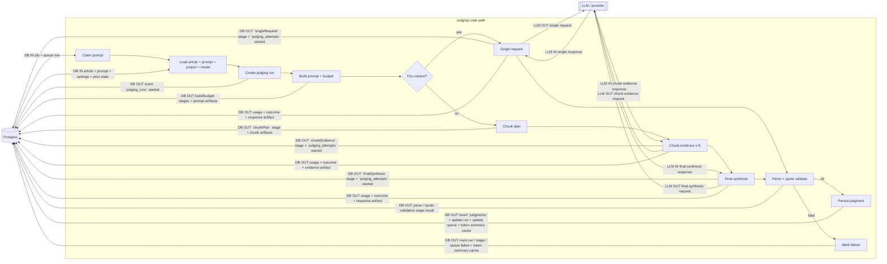

# EFFECT_PLAN_FOR_JUDGING

- Flow: `articleSnapshot -> promptSnapshot -> chunkPlan? -> chunkEvidence[]? -> finalSynthesis? -> judgment`
- Keep current request kinds from old code: `singleRequest`, `chunkEvidence`, `finalSynthesis`
- First principle: persist every run, stage, attempt, usage, and failure as it happens. Do not wait until the end to aggregate in memory.

## Wire diagram

- Center boxes are the main code path, top -> bottom.
- Side boxes are external systems; horizontal arrows are external interactions.
- `DB IN` = data returned from Postgres into judging code.
- `DB OUT` = data written from judging code to Postgres.

- Retries / fallbacks: same stage box runs again, but each resend first writes a new `judging_attempts` row.

## Foundation

- Refs: https://effect.website/docs/getting-started/the-effect-type/ https://effect.website/docs/requirements-management/layers/ https://effect.website/docs/schema/introduction/ https://effect.website/docs/data-types/cause/
- [ ] Model judging as small `Effect` services in `Layer`s: `ArticleSource`, `PromptBuilder`, `ChunkPlanner`, `ModelGateway`, `JudgmentStore`, `RunStore`, `Observability`
- [ ] Use `Schema` for all persisted envelopes: run, stage, attempt, usage, artifact, failure
- [ ] Use typed errors plus serialized `Cause`/`Exit`; stop reducing failures to one final string
- [ ] Keep pure transforms for `article -> prompt` and `prompt -> chunk plan`; all side effects happen at explicit boundaries

## DB / schema

- Refs: https://effect.website/docs/data-types/exit/ https://effect.website/docs/data-types/cause/ https://effect.website/docs/schema/introduction/
- [ ] Keep `judgments_jobs` + `judgments_jobs_prompts` as queue state only; no real-attempt data there
- [ ] Add `judging_runs`: one logical `articleId + promptId + modelId + contentSettings` execution; reruns create new rows, no unique dedupe here
- [ ] `judging_runs` cols: `jobId`, `jobPromptId`, `articleId`, `promptId`, `projectId`, `modelId`, `useTitle`, `useAbstract`, `useFulltext`, `useFulltextNoImages`, `chunkingStrategy`, `status`, `startedAt`, `finishedAt`, `finalJudgmentId`, `winningAttemptId`, `errorTag`, `errorMessage`, `causeJson`, `exitJson`
- [ ] Add `judging_stages`: one logical step: `prepareArticle`, `buildPrompt`, `chunkPlan`, `singleRequest`, `chunkEvidence`, `finalSynthesis`, `parseJudgment`, `persistJudgment`
- [ ] `judging_stages` cols: `runId`, `parentStageId`, `kind`, `status`, `chunkIndex`, `chunkCount`, `attemptCount`, `startedAt`, `finishedAt`, `inputArtifactId`, `outputArtifactId`, `errorTag`, `errorMessage`, `causeJson`
- [ ] Add `judging_attempts`: one real LLM call; immutable; linked to `stageId`
- [ ] `judging_attempts` cols: `runId`, `stageId`, `attemptNumber`, `planStep`, `retryOfAttemptId`, `requestKind`, `provider`, `baseURL`, `modelName`, `modelVersion`, `startedAt`, `finishedAt`, `status`, `promptTokens`, `completionTokens`, `totalTokens`, `usageJson`, `errorTag`, `errorMessage`, `causeJson`
- [ ] Add `judging_artifacts`: `runId`, `stageId`, `attemptId`, `kind`, `storageKind`, `textPreview`, `jsonPayload`, `contentHash`, `byteCount`; full payload may live outside DB if large
- [ ] Add FK `judgmentRunId` on `judgments`; final row points back to the run that produced it
- [ ] Indexes: `judging_runs(jobId, articleId, promptId)`, `judging_runs(status, startedAt)`, `judging_stages(runId, kind, chunkIndex)`, `judging_attempts(runId, stageId, status)`, `judging_attempts(requestKind, baseURL, startedAt)`
- [ ] Write `started` row before work and `succeeded/failed/interrupted` update after work; crashed work stays visible
- [ ] Migration order: add new tables first, dual-write second, switch reads third, delete legacy-only fields last if ever

## Pipeline

- Refs: https://effect.website/docs/stream/introduction/ https://effect.website/docs/concurrency/queue/ https://effect.website/docs/concurrency/semaphore/
- [ ] Create root `judgingRun` from article + prompt + model snapshot before any LLM call
- [ ] Persist selected article content snapshot and built system/user prompt before budget decision
- [ ] Run explicit budget stage; if within budget create one `singleRequest` stage
- [ ] If over budget, create `chunkPlan` first and persist strategy, chunk count, chunk sizes, chunk hashes, boundaries
- [ ] Run `chunkEvidence` stages with bounded concurrency; each chunk gets its own stage, attempts, usage, failures
- [ ] Run `finalSynthesis` only after required chunk evidence succeeds; persist merged evidence snapshot
- [ ] Parse, quote validation, and judgment write are separate stages; parse failure is not a generic request failure
- [ ] Store final judgment with provenance: content settings, chunking strategy, final stage id, winning attempt id

## Execution policy

- Refs: https://effect.website/docs/ai/planning-llm-interactions/ https://effect.website/docs/scheduling/introduction/
- [ ] Use `ExecutionPlan` + `Schedule` for retries, backoff, and fallback, even if v1 has one model step
- [ ] Persist `planStep`, `attemptNumber`, `retryOfAttemptId`, `provider`, `baseURL`, `modelName`, `startedAt`, `finishedAt`
- [ ] Retry only typed transient errors; schema, parse, and quote failures stay first-class and visible
- [ ] One shared concurrency limit for `singleRequest`, `chunkEvidence`, `finalSynthesis`, and retries

## Token use and failed requests

- Refs: https://effect.website/docs/observability/metrics/ https://effect.website/docs/data-types/cause/
- [ ] Store token usage on every `judging_attempts` row: reported `prompt/completion/total`, estimated fallback values, request/response sizes
- [ ] Derive run and job totals from `judging_attempts`; aggregate rows are cache, not source of truth
- [ ] Keep `token_use` as legacy/session summary during migration; stop treating `failedRequestsDetails` as authority
- [ ] `failedRequests` = `judging_runs` that end failed without `finalJudgmentId`
- [ ] `failedStages` = `judging_stages` that end failed
- [ ] `failedAttempts` = `judging_attempts` that end failed
- [ ] Never collapse chunk failures into one blob; keep exact `requestKind`, `chunkIndex`, `chunkCount`
- [ ] Keep connection failures visible as attempt failures with their own class, even if they do not count as logical failed requests

## Observability

- Refs: https://effect.website/docs/observability/logging/ https://effect.website/docs/observability/tracing/ https://effect.website/docs/observability/metrics/ https://effect.website/docs/observability/supervisor/
- [ ] Span tree: `judgingRun -> buildPrompt -> chunkPlan -> chunkEvidence[n] -> finalSynthesis -> parse -> persistJudgment`
- [ ] Annotate spans/logs with `runId`, `stageId`, `attemptId`, `articleId`, `promptId`, `modelId`, `chunkIndex`, `chunkCount`
- [ ] Emit counters, histograms, and gauges for attempts, runs, failures by stage/error class, latency, tokens, chunk count, in-flight work
- [ ] Add live admin queries/views for runs, stages, attempts, failures, artifacts, and oldest in-flight attempt
- [ ] Use persisted ids everywhere so one failure can be followed from UI -> logs -> trace -> DB row -> raw prompt/response

## Verification

- Refs: https://effect.website/docs/testing/testclock/
- [ ] Test direct success, chunked success, retry then success, parse failure, quote failure, connection failure, crash after send, and final synthesis failure
- [ ] Test that one long article shows exact failed chunk and spent tokens
- [ ] Test that rerun creates a new `judgingRun` and preserves old failed evidence for debugging
- [ ] Test that "what happened?" can be answered for any run without reading ad hoc console logs
